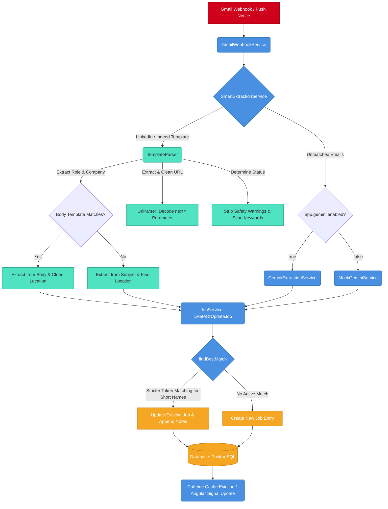

# JobTrackerPro 🚀


> **"I stopped using Excel to track my job applications. I architected an Enterprise-Grade platform instead."**

**JobTrackerPro** is a robust, full-stack solution designed to visualize, automate, and manage the interview pipeline. Unlike simple CRUD tutorials, this project demonstrates **Advanced System Design**, **Cloud-Native Architecture**, and **Production-Grade Security**.

---

## Who Is This For?

- Job seekers who want zero-effort tracking via email automation
- Engineers interested in real-world AI ingestion pipelines
- Developers learning enterprise Spring Boot + Angular architecture
- Open-source contributors looking for a non-trivial system to extend

---

## 📌 Project Status

- JobTrackerPro is actively developed and open for contributions.
- The `dev` branch is the primary development branch.
- The `main` branch is reserved for stable, production-ready releases.

---

## 🔗 Quick Links

- 🚀 Live Demo: https://jobtrackerpro.in
- 📂 Source Code: https://github.com/thughari/JobTrackerPro

---

## 🏗️ System Architecture & App Flow

JobTrackerPro is built as a highly automated, decoupled system focusing on security, latency reduction, and seamless user experiences.

### 🔄 End-to-End Application Flow



The system operates across four key pipeline phases:

#### 1. 📬 Automated Ingestion & Webhook Layer
- **Gmail Sync Integration**: Users link their Gmail account via OAuth2. A Google Pub/Sub topic listens to mailbox events and sends real-time push notifications to `GmailWebhookService`.
- **Smart routing (`SmartExtractionService`)**: Ingested emails are routed through a `@Primary` interceptor. It checks if the email is a standard template from **LinkedIn** or **Indeed**.
  - **Matched**: Processed locally instantly (0ms AI cost, sub-millisecond execution).
  - **Unmatched**: Delegated to **Google Gemini 2.0 Flash** (or local `MockGeminiService` if offline).

#### 2. ⚙️ Manual Extraction Engine (`TemplateParser`)
- **Forward Header Reconstruction**: Recognizes forwarded email structures so you can forward confirmation emails directly to your sync mailbox.
- **Indeed Body Parser**: Extracts the role, company name, and location directly from standard Indeed body layouts to avoid misidentifying hyphenated roles (e.g. `Java Backend Developer - MS` parses `Java Backend Developer - MS` as the role and `Capco` as the company).
- **Url query decoding**: Recognizes `apply.indeed.com` confirmation links, extracts their `next=` query parameter, URL-decodes it, and stores the direct public listing URL (e.g., `https://in.indeed.com/viewjob?jk=...`), reducing length from 220+ to ~50 characters.
- **Location & Status Cleaning**: Removes reviews meta-data (e.g. `Remote 95 reviews` -> `Remote`) and filters safety warning disclaimers to prevent false matches (e.g., preventing *"without an interview"* from triggering an *Interview Scheduled* status).

#### 3. 🧠 Smart Deduplication & Matching (`JobService`)
- When a parsed job hits `JobService.createOrUpdateJob()`, it compares the company and role with your active board entries:
  - **Strict Token matching**: If either company name is $\le 3$ characters (e.g., `MS`), it requires an exact word-token match rather than a simple substring `contains` check (preventing `MS` from matching `ORION SYSTEMS`).
  - **Status Updates**: If a match is found (e.g. an interview invite email for a job you already applied to), it updates the existing entry in-place and appends the email details to the transaction notes. Otherwise, it inserts a new job entry.

#### 4. 🎨 Reactive UI & In-Memory Caching
- **State Management**: The Angular frontend uses **Angular Signals** for reactive state updates, giving the user instant UI response.
- **Caffeine In-Memory Caching**: User profiles, dashboard analytics, and job lists are cached on the Spring Boot backend, automatically evicted upon job modifications to keep the UI up-to-date while protecting the DB from heavy read traffic.
- **Don't-Drown Slice Scaling**: The D3.js Donut Chart scales tiny slices (e.g., 1 application status out of 400+) up to a minimum 2.5% display size so they are visible and hoverable, while keeping tooltip values mathematically accurate.

---

## 🛠️ The Tech Stack

| Domain | Technology | Key Usage |
| :--- | :--- | :--- |
| **Backend** | **Java 21** | Modern JVM features (Records, Pattern Matching) |
| **Framework** | **Spring Boot 3.4** | REST API, Security, Data JPA |
| **Database** | **PostgreSQL** | Supabase managed instance (Transaction Mode) |
| **AI Model** | **Gemini 2.0 Flash** | Intelligent email parsing |
| **Storage** | **Cloudflare R2** | S3-compatible object storage |
| **Frontend** | **Angular 17** | Signals, Standalone Components, Optimistic UI |
| **Styling** | **TailwindCSS** | Utility-first styling, Dark Mode |
| **DevOps** | **Docker & Cloud Run** | Containerized serverless deployment |

---

## 📂 Project Structure

The repository is structured as a Monorepo:

```text
JobTrackerPro/
├── backend/                # Spring Boot API
│   ├── src/main/java/      # Controllers, Services, DTOs
│   ├── src/main/resources/ # Configurations for local, dev, prod # use local for dev
│   ├── Dockerfile          # Backend Container Config
│   ├── scripts             # Utility Scripts (e.g., simulate-email.sh)
│   └── service.yaml        # Google Cloud Run Config
├── frontend/               # Angular UI
│   ├── src/app/            # Components, Services, Guards
│   └── tailwind.config     # CSS Configuration
├── .github/workflows/      # CI/CD (GCP Cloud Run & GitHub Pages)
├── docker-compose.yml      # Local Dev Infrastructure 
└── README.md               # Documentation
```

---

## 🚀 One-Command Onboarding

You can run the entire ecosystem locally with **zero configuration**. The app automatically uses **Mock AI** and **Local File Storage** so you don't need any paid API keys to start contributing.

### 1. Spin up Infrastructure
Requires Docker Desktop. This starts PostgreSQL and MailHog (Email Trap).
```bash
docker-compose up -d
```

### 2. Start the Backend
```bash
cd backend
./mvnw spring-boot:run
```

### 3. Start the Frontend
```bash
cd frontend
npm install
npm start
```

### 4. Test the Features
- **Dashboard:** Access at `http://localhost:4200`.
- **Emails:** View outgoing emails at `http://localhost:8025` (MailHog).
- **AI Ingestion:** Use the `scripts/simulate-email.sh` to see the Mock AI create jobs automatically.

---

## 📸 Screenshots

| **Interactive Dashboard** | **Profile & Automation** |
|:---:|:---:|
|  |  |
| *Real-time D3.js analytics and charts* | *Email forwarding setup and secure settings* |

---

## 🤝 Contributing

Contributions are welcome!

1.  **Fork** the repository.
2.  Create a **Feature Branch** (`git checkout -b feature/AmazingFeature`).
3.  **Commit** your changes.
4.  **Push** to the branch.
5.  Open a **Pull Request** to branch `dev`.

---

## 📄 License

This project is licensed under the **MIT License**.

---

<div align="center">
  <h3>Designed & Engineered by <a href="https://thughari.github.io/">Hari Thatikonda</a></h3>
  <p><i>Building scalable systems with Java & Angular.</i></p>
  
  <a href="https://www.linkedin.com/in/hari-thatikonda/">
    
  </a>
  <a href="https://github.com/thughari">
    
  </a>
</div>


